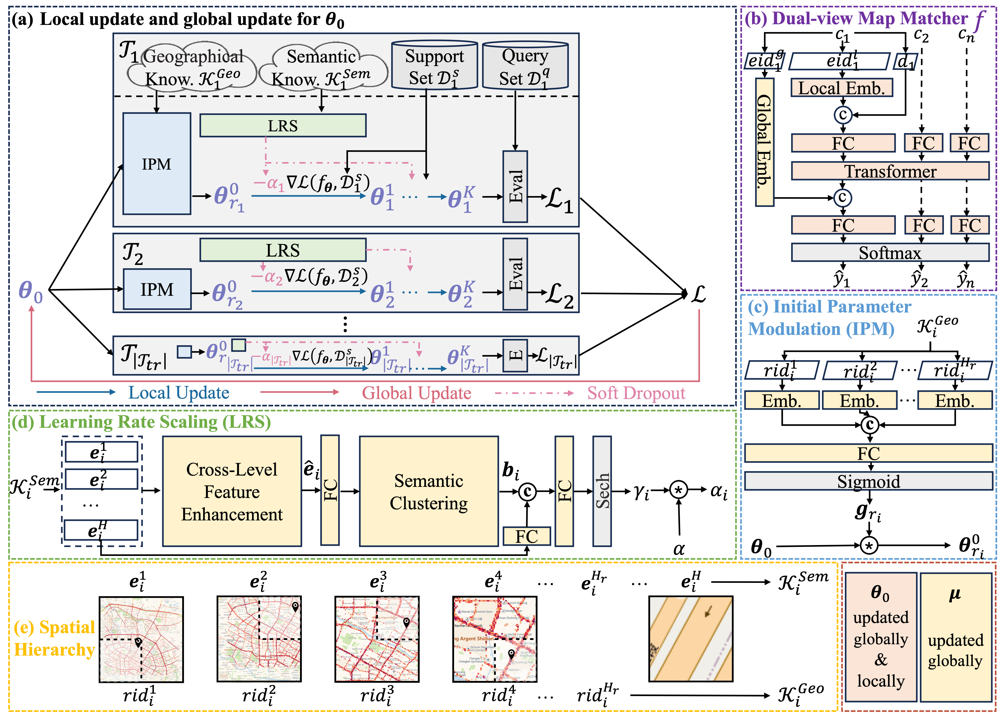

# Spatial Hierarchical Meta-Learning for Single-Point Map Matching


## Introduction

This code corresponds to the implementation of the paper "Spatial Hierarchical Meta-Learning for Single-Point Map Matching".


## Data Preparation
We provide one region of the processed public dataset in an anonymous link, https://www.dropbox.com/scl/fi/4zdxtjjucf3zpp4430xmr/data.zip?dl=0&e=2&rlkey=6qe7mmbunm0r68xsrlz18fwj7&st=l6t446gj

For semantic knowledge, we use osm feature. For convenience, here we provide both task-level features and multi-level features, though the latter one can be built directly from the former one.

The dataset consists of 6 dir / files:

- **cleaned_data**: Contains data from *Xi'an* for `single-point-map-matching (SMM)` and `single-point-map-matching-with-destination (SMMD)`. Meta-tasks will be constructed based on this.

- **task_osm_feature.pkl**: Contains task-level semantic knowledge.

- **{train/test/val}_task_avg_dict.pkl**: Contains multi-level semantic knowledge. As the name goes, these multi-level semantics are derived from region average of the task-level semantics.

- **edge_dictionary.pkl**: Contains the map from global-eids to local-eids for each task.


## Usage

### Data-Preprocessing:

Construct meta-tasks based on **cleaned_data**. To do this, run

```
python3 task_constructing.py --city 'xian' --granularity 512
```
    
Then you will get:

- **meta_{train/test/val}_tasks**: Contains meta-tasks in *Xi'an* for both support and query sets. 

- **data_info.csv**: Contains a table of sample number for each task.

### SMM:

* SHSMM: 
    
    ```
    python3 train.py --region 'XIAN'
    ```

* SHSMM-nGK: 

    ```
    python3 train.py --region 'XIAN' --use_gk ''
    ```
  
* SHSMM-nIPM: 
    
    ```
    python3 train.py --region 'XIAN' --spatial_hierarchy_info_list 'semantic'
    ```

* SHSMM-nLRS: 
    
    ```
    python3 train.py --region 'XIAN' --spatial_hierarchy_info_list 'geographical'
    ```

* SHSMM-nIDP: 

    ```
    python3 train.py --region 'XIAN' --eta 0.00
    ```

### SMMD:

* SHSMM: 
    
    ```
    python3 train.py --input_cat_destination 'True' --region 'XIAN'
    ```

* SHSMM-nGK: 

    ```
    python3 train.py --input_cat_destination 'True' --region 'XIAN' --use_gk ''
    ```
  
* SHSMM-nIPM: 
    
    ```
    python3 train.py --input_cat_destination 'True' --region 'XIAN' --spatial_hierarchy_info_list 'semantic'
    ```

* SHSMM-nLRS: 
    
    ```
    python3 train.py --input_cat_destination 'True' --region 'XIAN' --spatial_hierarchy_info_list 'geographical'
    ```

* SHSMM-nIDP: 

    ```
    python3 train.py --input_cat_destination 'True' --region 'XIAN' --eta 0.00
    ```
